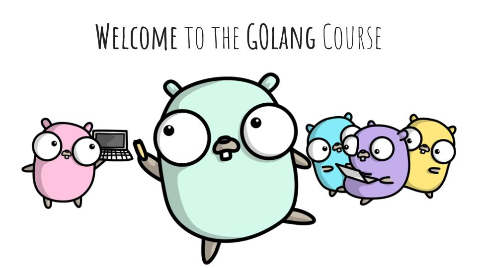

# go-for-it
My Golang Course

<table>
<thead>
<tr>
<th>Session</th>
<th align="center">Content</th>
</tr>
</thead>
<tbody>
<tr>
<td><a href="/s1/s1.go">Session 1</a></td>
<td>1- Golang vs Java. 2- Varriables & Constants. 3- Conditions and Loops</td>
</tr>
<tr>
<td><a href="/s2/s2.go">Session 2</a></td>
<td>1- Golang IDEs. 2- Functions and Errors. 3- Arrays</td>
</tr>
<tr>
<td><a href="/s3/s3.go">Session 3</a></td>
<td>1- Passing Functions as arguments. 2- Slices. 3- Maps. 4- Range</td>
</tr>
</tbody>
</table>